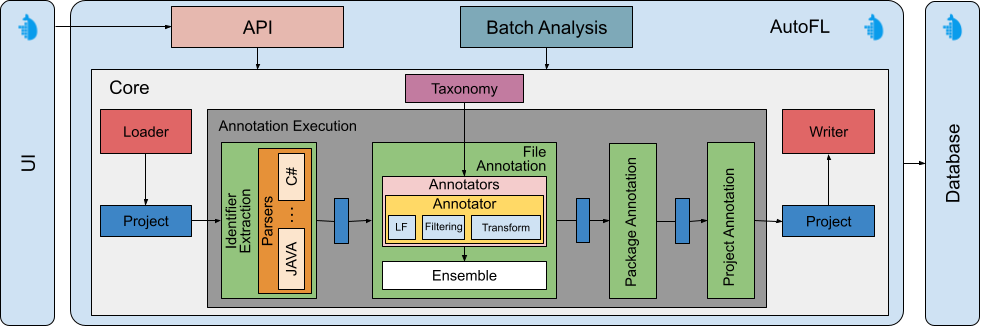

# AutoFL

[](https://www.gnu.org/licenses/gpl-3.0)
[](https://zenodo.org/doi/10.5281/zenodo.10255367)
[](https://hub.docker.com/r/cezarsas/autofl/)

Automatic source code file annotation using weak labeling.

## Overview

AutoFL is a tool designed for automatic annotation of source code files through weak labeling techniques. It provides both an API and a web-based UI for easy analysis of projects across different languages.

## Setup

To set up the repository along with its UI submodule, clone it using:

```bash
git clone --recursive git@github.com:SasCezar/AutoFL.git AutoFL
```

### Optional Model Setup

For advanced features like semantic-based labeling, download models as required. For example, to use **w2v-so**, download the model from [here](https://github.com/vefstathiou/SO_word2vec) and place it in the `data/models/w2v-so` folder. Alternatively, you can provide a custom path in the configuration files.

## Usage

To run the tool using Docker, navigate to the project directory (where the `docker-compose.yaml` file is located) and execute:

```shell
docker compose up
```

### API Endpoint

To analyze the files of a project, make a POST request to the following endpoint:

```shell
curl -X POST -d '{"name": "<PROJECT_NAME>", "remote": "<PROJECT_REMOTE>", "languages": ["<PROGRAMMING_LANGUAGE>"]}' localhost:8000/label/files -H "content-type: application/json"
```

For instance, to analyze the project at [https://github.com/mickleness/pumpernickel](https://github.com/mickleness/pumpernickel), use:

```shell
curl -X POST -d '{"name": "pumpernickel", "remote": "https://github.com/mickleness/pumpernickel", "languages": ["java"]}' localhost:8000/label/files -H "content-type: application/json"
```

### Web UI

AutoFL provides a web-based UI accessible locally at [http://localhost:8501](http://localhost:8501):


For more details, check the [UI repository](https://github.com/SasCezar/autofl-ui).

## Configuration

AutoFL uses [Hydra](https://hydra.cc/) to manage configurations. The configuration files can be found in the `config` folder. The main configuration file, `main.yaml`, allows you to customize various options:

- **local**: Choose between local or Docker environments. [Docker](config/environment/docker.yaml) is the default.
- **taxonomy**: Set the taxonomy for labeling. Currently supports [gitranking](./config/taxonomy/gitranking.yaml). You can add custom taxonomies.
- **annotator**: Specify the annotators to use. The default is [simple](./config/annotator/simple.yaml), offering good results without dependencies on language models.
- **version_strategy**: Select the versioning strategy. The default is [latest](./config/version_strategy/latest.yaml).
- **dataloader**: Choose the dataloader. The default is [postgres](./config/dataloader/postgres.yaml).
- **writer**: Set the writer for storing results. The default is [postgres](./config/writer/postgres.yaml).

Additional configurations can be added by creating new files in the corresponding component folders.

## Functionalities

- Annotation (UI/API/Script)
  - File-Level
  - Package-Level
  - Project-Level
- Batch Analysis (Script Only)
- Temporal Analysis (**TODO**)
- Classification (**TODO**)

## Supported Languages

- Java
- Python (untested)
- C (untested)
- C++ (untested)
- C# (untested)

## Development

AutoFL is composed of multiple components, as shown in the architecture diagram below:



### Adding Support for New Languages

To add support for additional languages, a language-specific parser is required. You can use [tree-sitter](https://tree-sitter.github.io/tree-sitter/) to develop a parser quickly.

#### Parser Details

The parser needs to be located in the `parser/languages` folder. It should extend the `BaseParser` class, which follows this structure:

```python
class ParserBase(ABC):
"""
Abstract class for a programming language parser.
"""

    def __init__(self, library_path: Path | str):
        """
        :param library_path: Path to the tree-sitter languages.so file. The file has to contain the
        language parser. See tree-sitter for more details
        """
        ...
```

To implement the parsing logic, create a class that handles extracting identifiers. For Python, the parser might look like:

```python
class PythonParser(ParserBase, lang=Extension.python.name):
    """
    Python-specific parser using a generic grammar for multiple versions. Utilizes tree-sitter for AST extraction.
    """

    def __init__(self, library_path: Path | str):
        ...
```

A custom parser independent of tree-sitter can also be developed. For more details, refer to the implementation of [ParserBase](src/parser/parser.py).

## Known Issues

- **Dependency Installation**: The setup process may take significant time (~10 minutes), and dependency installations might fail due to timeouts. This appears to be a network-related issue, and retrying often resolves it. Future updates will aim to simplify dependencies.
- **~~Indefinite Analysis Loops~~**: ~~In some projects, the analysis may loop indefinitely. This issue is currently under investigation.~~ Seems solved in the latest version. Will monitor for further occurrences.

## Docker Image Availability

AutoFL is also available as a Docker image. You can pull the image from Docker Hub using:

```shell
docker pull cezarsas/autofl
```

Find more details and updates at the [Docker Hub page](https://hub.docker.com/r/cezarsas/autofl/).

## Disclaimer

This tool is in active development and may not function as expected in some cases. It has been tested primarily on Docker versions `24.0.7` and `25.0.0` for `Ubuntu 22.04`. Limited testing has been performed on `Windows` and `MacOS`, where functionality may vary.

If you encounter any issues, please open an issue on GitHub, make a pull request, or contact me at `c.a.sas@rug.nl`.

## Citation

If you find this tool useful, please cite our work:

### Paper

```bibtex
@article{sas2024multigranular,
title     = {Multi-granular Software Annotation using File-level Weak Labelling},
author    = {Cezar Sas and Andrea Capiluppi},
journal   = {Empirical Software Engineering},
volume    = {29},
number    = {1},
pages     = {12},
year      = {2024},
url       = {https://doi.org/10.1007/s10664-023-10423-7},
doi       = {10.1007/s10664-023-10423-7}
}
```

**Note**: The code used in this paper is available at [CodeGraphClassification](https://github.com/SasCezar/CodeGraphClassification). However, AutoFL provides enhanced features, is more user-friendly, and includes a UI.

### Tool

```bibtex
@software{sas2023autofl,
          author    = {Sas, Cezar and Capiluppi, Andrea},
          month     = oct,
          title     = {{AutoFL}},
          url       = {https://github.com/SasCezar/AutoFL},
          version   = {0.5.0},
          year      = {2024},
          url       = {https://doi.org/10.5281/zenodo.13895493},
          doi       = {10.5281/zenodo.13895493}
}
```