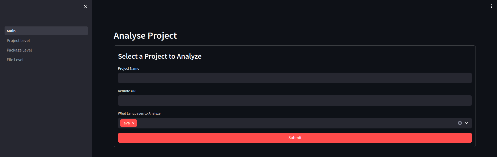

# AutoFL

Automatic source code file labelling using weak labelling.

## Usage

Run docker the docker compose file [docker-compose.yaml](docker-compose.yaml) by executing:
```shell
docker compose up
```
in the project folder.

### API Endpoint
You can analyze the files of project by making a request to the endpoint:
```shell

```

If you want the analysis at the package level
```shell

```

For the project level
```shell

```

### UI

We also offer a web UI that is available at the following page (when running locally):
[ http://0.0.0.0:8501](http://0.0.0.0:8501)



For more details, check the [UI repo](https://github.com/SasCezar/autofl-ui)

## Functionalities

- Annotation (UI/API/Script)
  - File
  - Package (**TODO**)
  - Project (**TODO**)
- Batch Analysis (Script Only)
- Temporal Annotation (**TODO**)
- Classification (**TODO**)

## Development

### Add New Languages 

In order to support more languages, a new language specific parser is needed. 
We can create one quickly by using [tree-sitter](https://tree-sitter.github.io/tree-sitter/),
and a custom parser.

#### Parser
The parser needs to be in the [parser/languages](./src/parser/languages) folder. 
It has to extend the ```BaseParser``` class, which has the following interface.

```python
class ParserBase(ABC):
    """
    Abstract class for a programming language parser.
    """

    def __init__(self, library_path: Path | str):
        """
        :param library_path: Path to the tree-sitter languages.so file. The file has to contain the
        language parser. See tree-sitter for more details
        """
        ...
```
And the language specific class has to contain the logic to parse the language to get the identifiers.
For example for Python, the class will look like this:

```python
class PythonParser(ParserBase, lang=Extension.python.name):  # The lang argument is used to register the parser in the ParserFactory class.
    """
    Python specific parser. Uses a generic grammar for multiple versions of python. Uses tree_sitter to get the AST
    """

    def __init__(self, library_path: Path | str):
        super().__init__(library_path)
        self.language: Language = Language(library_path, Extension.python.name)   # Creates the tree-sitter language for python
        self.parser.set_language(self.language)                                   # Sets tree-sitter parser to parse the language
        
        # Pattern used to match the identifiers, it depends on the Lanugage. Check tree-sitter
        self.identifiers_pattern: str = """
                                        ((identifier) @identifier)
                                        """
        
        # Creates the query used to find the identifiers in the AST produced by tree-sitter
        self.identifiers_query = self.language.query(self.identifiers_pattern)

        # Keyword that will be ignored, in this case, the language specific keywords as the query extracts them as well. 
        self.keywords = set(keyword.kwlist)  # Use python's built in keyword list
        self.keywords.update(['self', 'cls'])
```

A custom class that does not rely on tree-sitter can be also used, however, there are more methods from ParserBase that need to be
changed. Check the implementation.